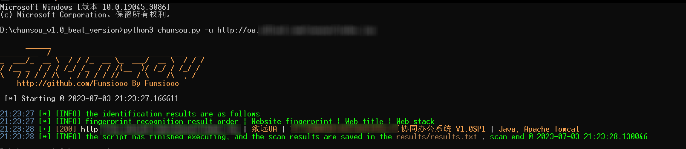
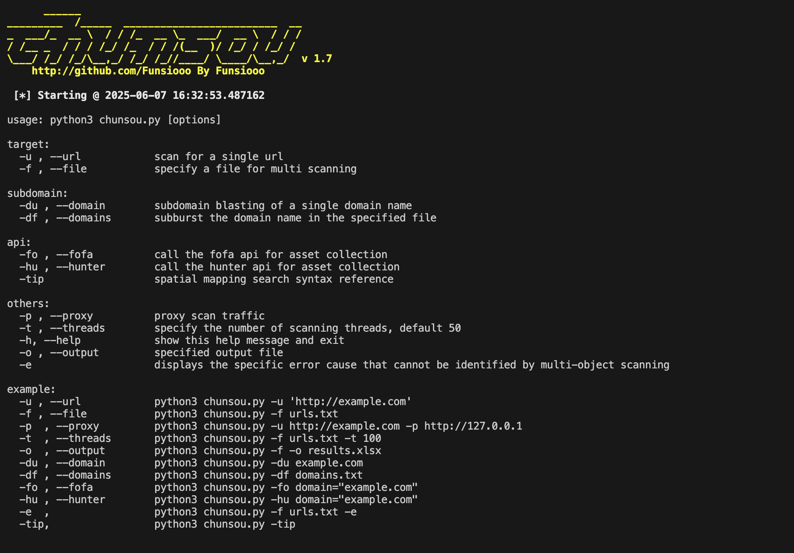

## 📖 简介

-bottlegreen?logo=github)     

Chunsou（春蒐），Python3编写的多线程Web指纹识别工具，适用于安全测试人员前期的资产识别、风险收敛以及企业互联网资产摸查。目前主要功能为针对Web资产进行指纹识别，目前指纹规则条数约 10000+，辅助功能包括子域名爆破和FOFA、Hunter资产收集。工具开发初衷为辅助网络安全人员开展测试工作，提高资产识别和管理的效率。



[\[English Readme\]](https://github.com/Funsiooo/chunsou/tree/main/doc/Readme.md)


## 🥏 选项

Chunsou（春蒐）支持多线程扫描（默认50线程，支持自定义）、联动OneForAll爆破子域名、调用Fofa、Hunter API收集资产、配置流量代理，以及自定义结果输出路径。



```
usage: python3 chunsou.py [options]

target:
  -u, --url            scan for a single url
  -f, --file           specify a file for multi scanning

subdomain:
  -du, --domain        subdomain blasting of a single domain name
  -df, --domains       subburst the domain name in the specified file

api:
  -fo, --fofa          call the fofa api for asset collection
  -hu, --hunter        call the hunter api for asset collection
  --ai [{auto,force}]  enable semantic analysis, default auto
  --ai-provider        specify ai provider
  --ai-model           specify ai model
  -tip                 spatial mapping search syntax reference

others:
  -p, --proxy          proxy scan traffic
  -t, --threads        specify the number of scanning threads, default 50
  -h, --help           show this help message and exit
  -o, --output         specified output file
  -e                   displays the specific error cause that cannot be identified by multi-object scanning

example:
  -u , --url            python3 chunsou.py -u 'http://example.com'
  -f , --file           python3 chunsou.py -f urls.txt
  --ai                  python3 chunsou.py -u http://example.com --ai
  --ai auto             python3 chunsou.py -f urls.txt --ai auto --ai-provider deepseek
  --ai force            python3 chunsou.py -u http://example.com --ai force --ai-provider gpt
  -p  , --proxy         python3 chunsou.py -u http://example.com -p http://127.0.0.1
  -t  , --threads       python3 chunsou.py -f urls.txt -t 100
  -o  , --output        python3 chunsou.py -f -o results.xlsx
  -du , --domain        python3 chunsou.py -du example.com
  -df , --domains       python3 chunsou.py -df domains.txt
  -fo , --fofa          python3 chunsou.py -fo domain="example.com"
  -hu , --hunter        python3 chunsou.py -hu domain="example.com"
  -e  ,                 python3 chunsou.py -f urls.txt -e
  -tip,                 python3 chunsou.py -tip
```


## 🛫 使用

> 说明

目前输出文件默认保存在 `results` 目录下，现支持`txt`、`xlsx` 格式，指纹识别输出信息显示顺序 `| 已匹配到的指纹 | 网站标题 | 网站所用的技术栈`


> 安装依赖

```
pip3 install -r requirements.txt
```


> 具体使用指令

```python
# AI 指纹识别（已接入 DeepSeek 与 ChatGPT）
python3 chunsou.py -u 'http://example.com' --ai
python3 chunsou.py -u 'http://example.com' --ai --ai-provider deepseek
python3 chunsou.py -f urls.txt --ai force --ai-provider gpt --ai-model gpt-4o

python3 chunsou.py -u 'http://example.com' --ai force
python3 chunsou.py -u 'http://example.com' --ai force --ai-provider gpt --ai-model gpt-4o

# 单目标指纹识别（ 注:若url出现特殊字符如 ?&$ 等，不使用单引号包裹会导致报错）
python3 chunsou.py -u 'http://example.com'

# 多目标指纹识别（默认只输出成功请求的结果，报错url不显示，若需要显示报错信息加上 -e ，扫描网段.txt内容格式例：192.168.1.0/24、192.168.1.1-192.168.1.1-100）
python3 chunsou.py -f urls.txt

# 单目标子域名爆破(目前调用 oneforall 进行子域名爆破)
python3 chunsou.py -du example.com

# 多目标子域名爆破
python3 chunsou.py -df domains.txt

# 调用 fofa api 进行资产收集,需要在 /modules/config/config.ini 进行 fofa api key 配置
python3 chunsou.py -fo domain="example.com"

# 调用 hunter api 进行资产收集,需要在 /modules/config/config.ini 进行 hunter api key 配置
python3 chunsou.py -hunter domain="example.com"

# 输出显示 fofa hunter 基本搜索语法
python3 chunsou.py -tip

# 指定线程（默认50）
python3 chunsou.py -u http://example.com -t 100

# 指定输出结果格式（txt、xlsx）
python3 chunsou.py -f urls.txt -o result.xlsx

# 代理流量（http、https、socks5）
python3 chunsou.py -f urls.txt -p http://127.0.0.1:7890

```


## 🪐 指纹

 

部分指纹来源于优秀开源项目 [Ehole](https://github.com/EdgeSecurityTeam/EHole) 、 [dismap](https://github.com/zhzyker/dismap)、 以及部分自收集，目前指纹规则条数约 10000+ (指纹条数，非程序个数)

指纹规则，目前支持`网站关键字`、`网站 title`、`网站 header`、`网站 ico hash` 四种指纹匹配方式，相应规则如下：

```json
{
    "cms": "亿赛通电子文档安全管理系统",
    "method": "keyword",
    "location": "body",
    "keyword": ["电子文档安全管理系统", "CDGServer3"]
}, {
    "cms": "禅道",
    "method": "icon_hash",
    "location": "body",
    "keyword": ["3514039281"]
}, {
    "cms": "ecology",
    "method": "keyword",
    "location": "header",
    "keyword": ["ecology_JSessionid"]
}, {
    "cms": "Nacos",
    "method": "keyword",
    "location": "title",
    "keyword": ["Nacos"]
}
```


## 🛎️ FQA

```
1、后续加强对现有指纹的适配以及不定期更新自收集的指纹
2、bug反馈：https://github.com/Funsiooo/chunsou/issues
3、使用时注意网络问题，由于部分网站防火墙或其他策略原因使用科学网络或网络不稳定会导致部分扫描报错异常
4、工具更新详情可查看log.md
5、指纹不定期更新，最新指纹请下载 modules/config/finger.json 文件自行替换
```


## ⭐ Star History

[](https://star-history.dera.page/#Funsiooo/chunsou&Date)
