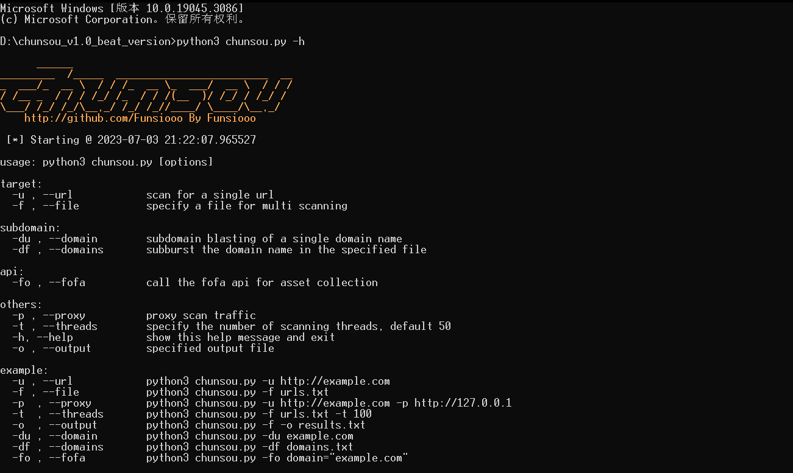

## 📖 Introduction

   

Chunsou is a multi-threaded web fingerprint recognition tool written in Python, which is suitable for security testers to identify assets, converge risks, and investigate enterprise Internet assets in the early stage. It mainly focuses on web assets for fingerprint recognition, currently supporting about 10000+ fingerprint rules. In addition, the tool also provides auxiliary functions such as subdomain blasting and Fofa and Hunter asset collection. The tool was developed with the aim of helping network security personnel improve the efficiency of asset identification and management, and assist them in conducting testing work.


## 🥏 Options

Chunsou is capable of multi-threaded scanning with the default number of threads set to 50, which can be specified according to the user's requirements. It can be linked with oneforall for subdomain blasting and supports calling the fofa API for asset collection. It also allows for custom traffic proxy and the ability to specify the output result path.



```
usage: python3 chunsou.py [options]

target:
  -u , --url            scan for a single url
  -f , --file           specify a file for multi scanning

subdomain:
  -du , --domain        subdomain blasting of a single domain name
  -df , --domains       subburst the domain name in the specified file

api:
  -fo , --fofa          call the fofa api for asset collection
  -hu , --hunter        call the hunter api for asset collection
  -tip                  spatial mapping search syntax reference

others:
  -p , --proxy          proxy scan traffic
  -t , --threads        specify the number of scanning threads, default 50
  -h, --help            show this help message and exit
  -o , --output         specified output file

example:
  -u , --url            python3 chunsou.py -u http://example.com
  -f , --file           python3 chunsou.py -f urls.txt
  -p  , --proxy         python3 chunsou.py -u http://example.com -p http://127.0.0.1
  -t  , --threads       python3 chunsou.py -f urls.txt -t 100
  -o  , --output        python3 chunsou.py -f -o results.xlsx
  -du , --domain        python3 chunsou.py -du example.com
  -df , --domains       python3 chunsou.py -df domains.txt
  -fo , --fofa          python3 chunsou.py -fo domain="example.com"
  -hu , --hunter        python3 chunsou.py -hu domain="example.com"
  -tip,                 python3 chunsou.py -tip
```


## 🛫 Usage

> explanation

Currently, the output file is saved by default in the `results` directory and supports `txt` and `xlsx` formats. The output information for fingerprint recognition is displayed in the following order: `| Matched fingerprints | Website Title | Technology Stack used by the website`.


> install dependencies

```
pip3 install -r requirements.txt
```


> specific usage instructions

```python
# Single target fingerprint recognition
python3 chunsou.py -u http://example.com

# Multiple targets fingerprint recognition
python3 chunsou.py -f urls.txt

# Single target subdomain blasting (currently using oneforall for subdomain blasting)
python3 chunsou.py -du example.com

# Multiple targets subdomain blasting
python3 chunsou.py -df domains.txt

# Chunsou supports using the FOFA API for asset collection. To use this feature, you need to configure your FOFA API credentials in the /modules/config/config.ini file by adding the following lines:
python3 chunsou.py -fo domain="example.com"

# Chunsou supports using the Hunter API for asset collection. To use this feature, you need to configure your Hunter API credentials in the /modules/config/config.ini file by adding the following lines:
python3 chunsou.py -hu domain="example.com"

# The output displays the fofa and hunter basic search syntax
python3 chunsou.py -tip

# Specifying the number of threads
python3 chunsou.py -u http://example.com -t 100

# Specifying the output file format (txt、xlsx)
python3 chunsou.py -f urls.txt -o result.xlsx

# Using a proxy for traffic（http、https、socks5）
python3 chunsou.py -f urls.txt -p http://127.0.0.1:7890
```


## 🪐 Fingerprint

 

The fingerprint rules of the tool are partially sourced from excellent open-source projects such as [Ehole](https://github.com/EdgeSecurityTeam/EHole) and [dismap](https://github.com/zhzyker/dismap), as well as some self-collected rules. Currently, there are about 10,000+ fingerprint rules (number of rules, not the number of programs).

The fingerprint rules currently support four matching methods: `website keywords`, `website title`, `website header`, and `website ico hash`. The corresponding rules are as follows:

```json
{
    "cms": "亿赛通电子文档安全管理系统",
    "method": "keyword",
    "location": "body",
    "keyword": ["电子文档安全管理系统", "CDGServer3"]
}, {
    "cms": "禅道",
    "method": "icon_hash",
    "location": "body",
    "keyword": ["3514039281"]
}, {
    "cms": "ecology",
    "method": "keyword",
    "location": "header",
    "keyword": ["ecology_JSessionid"]
}, {
    "cms": "Nacos",
    "method": "keyword",
    "location": "title",
    "keyword": ["Nacos"]
}
```


## 🛎️ FQA

```
1、the tool will continue to strengthen the adaptation to existing fingerprints and update the self-collected fingerprints 	    periodically to ensure the accuracy and effectiveness of the fingerprinting feature.
2、bug feedback：https://github.com/Funsiooo/chunsou/issues
3、 pay attention to network problems when using, due to the use of scientific network or network instability for some website firewalls or other strategic reasons, some scanning errors will be abnormal
4、 tool update details can be seen in log.md
5、 the fingerprint is not updated regularly, fingerprint please download the latest modules/config/finger. The json file to replac
```


## ⭐ Star History

[](https://star-history.com/#Funsiooo/chunsou&Date)
